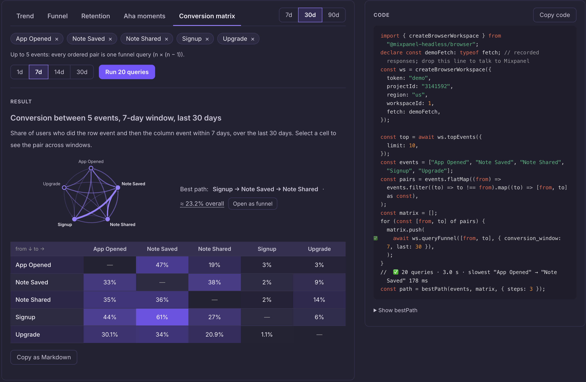

# Mixpanel Headless for TypeScript

**Build the Mixpanel tool you wish existed.**

A launch page with the metrics your team cares about. A conversion explorer for your
product's journeys. An agent that reads session replays and helps investigate a bug.

Mixpanel Headless gives your code typed access to Mixpanel's queries, reports,
session replays, cohorts, feature flags, experiments, and more. Build with
JavaScript or TypeScript, or give your coding agent the docs and describe what you
want.

**[Try the playground →](https://jaredmixpanel.github.io/mixpanel-headless-ts/demo/)**
· [Build with your coding agent](#build-with-your-coding-agent)
· [Run your first query](#run-your-first-query)

No installation or account needed for the demo. Explore the synthetic project,
see the code behind each result, then sign in to query your own project.

[](https://jaredmixpanel.github.io/mixpanel-headless-ts/demo/)

_Preview: the playground is live. The library packages are not yet published to
npm, and APIs may change. Use the [source setup below](#run-your-first-query) to
build with the library today._

## See what a loop can do

Open **Conversion matrix** in the playground. Choose five events and run twenty
funnels, one for each ordered pair. Explore the conversion map, select a connection
to compare time windows, then investigate a suggested path as a funnel. Sign in to
open it in your own Mixpanel project. The code is beside the result.

That is the useful part of having Mixpanel in code: you can loop over queries,
compare their results, add your own calculations, and give the analysis an
interface of its own.

## What will you build?

| Build this                           | Make it your own                                                                                                                                                     |
| ------------------------------------ | -------------------------------------------------------------------------------------------------------------------------------------------------------------------- |
| **Your launch, on one page**         | Put signups, activation, and purchase conversion in a page shaped around your launch. Link it from the launch channel and rerun the queries when you need an update. |
| **A product-journey explorer**       | Compare event pairs and conversion windows, investigate a drop-off, and open the underlying funnel in Mixpanel.                                                      |
| **A replay investigation assistant** | Fetch a user's recordings and turn navigation, clicks, and errors into readable timelines an agent can analyze.                                                      |

**In a browser**, a page can query Mixpanel under the viewer's own login using
OAuth, without an application backend. Your page controls which queries run;
Mixpanel enforces the viewer's permissions. See the
[browser guide](https://jaredmixpanel.github.io/mixpanel-headless-ts/guide/browser)
for login, credential storage, and reconnect behavior.

**In Node.js**, the same query vocabulary fits scripts, scheduled jobs, webhook
handlers, and your existing product code. Stream events into a warehouse, bring
adoption numbers back to a pull request, or make session replay part of an
investigation workflow.

## Build with your coding agent

Open this repository in your coding agent and give it a concrete starting point:

```text
Build a launch metrics page using mixpanel-headless-ts in this checkout.
Read https://jaredmixpanel.github.io/mixpanel-headless-ts/llms.txt and the
browser, discovery, funnel, and report-link guides it links to.

Use the local packages; they are not published to npm yet.
Sign in through the browser package with my own Mixpanel login.
Discover the project's real event names and let me choose the funnel steps.
Show conversion, the measurement window, and the last-updated time.
Include refresh, sign-in-again, and "Open in Mixpanel" actions.
Do not modify dashboards, cohorts, flags, or project settings.
Keep credentials out of the source code.
```

The docs include runnable TypeScript examples checked against the packages during
the site build, an [index for agents](https://jaredmixpanel.github.io/mixpanel-headless-ts/llms.txt),
and [the full documentation](https://jaredmixpanel.github.io/mixpanel-headless-ts/llms-full.txt).
The [browser guide](https://jaredmixpanel.github.io/mixpanel-headless-ts/guide/browser)
covers the authentication setup the generated page needs. Playground snippets show
the query code; a standalone page also needs its own login and UI.

## Run your first query

For the preview, run examples inside a source checkout so imports resolve to the
local packages. You'll need **Node 22.22.2+ within 22.x, or Node 24.15+**.
Plain JavaScript works; no TypeScript setup is needed for these examples.

```sh
git clone https://github.com/jaredmixpanel/mixpanel-headless-ts.git
cd mixpanel-headless-ts
npm ci
npm run build
```

**Sign in once.** Save this as `login.mjs` in the repository root. Replace the
project ID and set your project's region (`us`, `eu`, or `in`), then run
`node login.mjs`:

```javascript
import { loginUnified } from "@mixpanel-headless/node";

await loginUnified({ region: "us", project: "12345" });
```

With no credential environment variables set, this opens the Mixpanel login flow
and saves your account locally. Already signed in with the Python library's `mp`
CLI? Both libraries use `~/.mp/config.toml`, so you can skip this step. For scripts
and CI, see the [other authentication options](https://jaredmixpanel.github.io/mixpanel-headless-ts/getting-started/quickstart#other-auth-paths).

**Discover your events.** Save this as `first-query.mjs` in the repository root,
set the same project ID, and run `node first-query.mjs`:

```javascript
import { createNodeWorkspace } from "@mixpanel-headless/node";

const ws = createNodeWorkspace({ project: "12345" });
console.log(await ws.events());
```

**Run a funnel and open it in Mixpanel.** Append the code below to
`first-query.mjs`, replacing the example event names with names from your project,
then run the file again:

```javascript
const result = await ws.queryFunnel(["Signup", "Purchase"], {
  last: 30,
  conversion_window: 7,
});

console.table(result.toRows());

const link = await ws.createReportLink(result, { name: "My first funnel" });
console.log(link.url);
await ws.close();
```

This measures a two-step funnel over the last 30 days with a seven-day conversion
window. The link opens the query in Mixpanel so you can inspect it, adjust it,
and share it with your team.

## More building blocks

| What you need                                           | Where to start                                                                                                                                                                                                                                                                                    |
| ------------------------------------------------------- | ------------------------------------------------------------------------------------------------------------------------------------------------------------------------------------------------------------------------------------------------------------------------------------------------- |
| Event counts, active users, formulas, and breakdowns    | [Insights queries](https://jaredmixpanel.github.io/mixpanel-headless-ts/guide/query)                                                                                                                                                                                                              |
| Conversion, return behavior, and user journeys          | [Funnels](https://jaredmixpanel.github.io/mixpanel-headless-ts/guide/query-funnels), [retention](https://jaredmixpanel.github.io/mixpanel-headless-ts/guide/query-retention), [flows](https://jaredmixpanel.github.io/mixpanel-headless-ts/guide/query-flows)                                     |
| Event names, properties, and user profiles              | [Discovery](https://jaredmixpanel.github.io/mixpanel-headless-ts/guide/discovery), [profile queries](https://jaredmixpanel.github.io/mixpanel-headless-ts/guide/query-users)                                                                                                                      |
| Queries you can open and share in Mixpanel              | [Report links](https://jaredmixpanel.github.io/mixpanel-headless-ts/guide/report-links)                                                                                                                                                                                                           |
| Event/profile exports and replay analysis               | [Streaming](https://jaredmixpanel.github.io/mixpanel-headless-ts/guide/streaming), [session replay](https://jaredmixpanel.github.io/mixpanel-headless-ts/guide/session-replay)                                                                                                                    |
| Dashboards, cohorts, flags, experiments, and governance | [Entity management](https://jaredmixpanel.github.io/mixpanel-headless-ts/guide/entity-management), [data governance](https://jaredmixpanel.github.io/mixpanel-headless-ts/guide/data-governance), [business context](https://jaredmixpanel.github.io/mixpanel-headless-ts/guide/business-context) |

Use `@mixpanel-headless/browser` for pages and `@mixpanel-headless/node` for
scripts and services. They share the query builders and result types from
`@mixpanel-headless/core`. All packages are ESM and ship TypeScript declarations.
The [API reference](https://jaredmixpanel.github.io/mixpanel-headless-ts/api/)
covers the full surface.

## Built to be checked

The TypeScript port is verified against the
[Python library](https://github.com/mixpanel/mixpanel-headless) using recorded
requests, results, and errors, plus generated cross-language comparisons. The
September 14, 2026 runs recorded [3,453 passing test vectors](conformance-runner/GATE.md)
and [28,091 generated examples across 55 families with no mismatches](differential/oracle/RUN.md).
[Known differences and the limits of those checks](PORTING.md#what-the-rig-proves--and-does-not)
are documented.

TypeScript checks option names and argument types before your code runs. The
library's [error hierarchy](https://jaredmixpanel.github.io/mixpanel-headless-ts/guide/error-handling)
provides stable codes and structured details for handling failures in scripts and
agents.

### Naming

Coming from Python? Methods use camelCase, query options keep snake_case, and
network calls use `await`. Results expose plain rows through `toRows()` where
Python offers a DataFrame. The [migration guide](https://jaredmixpanel.github.io/mixpanel-headless-ts/guide/coming-from-python)
covers the conventions and differences.

## What do you wish your team had?

[Share a tool idea, a prototype, or a rough edge](https://github.com/jaredmixpanel/mixpanel-headless-ts/issues/new).
A recurring question, a place the numbers should appear, or a workflow you want to
automate is enough to start.

[Documentation](https://jaredmixpanel.github.io/mixpanel-headless-ts/)
· [Contributing](CONTRIBUTING.md)
· [Apache 2.0 license](LICENSE)
